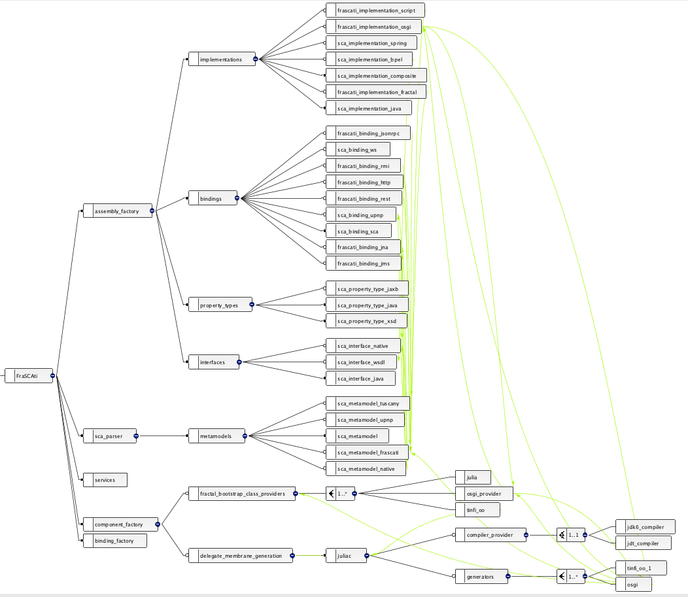

# Reverse Engineering Architectural Feature Models 

note: the content was originally written in 2011... we edited some parts

The following web page provides material, details and results of the experiments we conduct in reverse engineering an architectural feature model of the [FraSCAti project](http://frascati.ow2.org). The web page is related to a paper accepted at [ECSA 2011 conference](http://www.ecsa2011.org/), entitled "Reverse Engineering Architectural Feature Models" (preprint here: https://hal.inria.fr/inria-00614984) 

## Reverse Engineering FraSCAti Architectural Feature Model 

### FraSCAti 

Started three years ago, the development of the FraSCAti platform begun with a framework, first validated by a basic implementation of the standard, and then incrementally enhanced.
After four major releases, it now supports several SCA specifications (Assembly Model, Transaction Policy, Java Common Annotations and APIs, Java Component Implementation, Spring Component Implementation, BPEL Client and Implementation, Web Services Binding, JMS Binding), and provides a set of extensions to the standard, 
including binding implementation types (HTTP, Java RMI, JMS, JSON-RPC, REST, SOAP, JNA, UPnP), component implementation types (composite, Java, BPEL, Fractal, OSGi, Scala, Java supported scripting languages like !BeanShell, Groovy, !JavaScript, Jython, JRuby), interface description types (Java, WSDL, UPnP, C headers), property description types (Java et XSD), runtime API for assembly and component introspection/reconfiguration (see paper at [http://hal.inria.fr/inria-00397856 SCC'09]).

As its capabilities grew, FraSCAti has also been refactored and completely architected itself with SCA components.
With all these capabilities, the platform has become highly (re-)configurable in many parts of its own architecture.
It notably exposes a larger number of extensions that can be activated throughout the platform, creating numerous variants of a FraSCAti deployment.
For example, some variations consist in one or more specific components bound to many other mandatory or optional parts of the platform architecture.
It then became obvious to FraSCAti technical leads that the variability (i.e., "the ability of a software system or artefact to be efficiently extended, changed, customized or configured for use in a particular context.") of the platform should be managed to pilot and control its evolution as a ''Software Product Line (SPL)''.

### FraSCAti Artefacts 

The entire set of .composite files and SCA diagrams form the "architectural model" of FraSCAti.

.composite_diagram and .png files have been automatically generated using Eclipse SCA Tools (plus a manual layout). 

You can download the .composite and .composite_diagram files below. Note that the files are from the last version of the FraSCAti project. 

 #### main SCA composite of FraSCAti (other components are described below) 

 <!-- .element height="40%" width="40%" -->

 #### implementations, interfaces, bindings and properties 
 <!-- .element height="50%" width="50%" -->

 #### SCA composite of the FraSCAti parser

 #### SCA composite of the FraSCAti composite parser 

 #### metamodels supported by the FraSCAti SCA parser 

 #### membranes 

 #### Java compilers and membrane generators 

 #### binding factory 

 #### services (empty composite at the moment) 

 ### Variability Modeling 

In order to manage the FraSCAti platform as an SPL, we needed to capture its variability from the existing architecture.
We chose to rely on a particular kind of variability model, ''Feature Models (FMs)'', based on their wide adoption, the existence of formal semantics, reasoning techniques and tool support.  
Several software artefacts (SCA composite files, Maven descriptors, unformal documents) describe FraSCAti architecture, but variability, though, is not explicitly represented.
As the FraSCAti main ''software architect (SA)'' had an extensive expertise in the architecture and in its evolution, it was decided to make him model the architecture he has in mind with variation points (see left part of the figure). As a domain expert, he had the ability to elicitate the architectural variation points and explain rationale behind these decisions.

This task resulted in a manually created FM (see Figure, or  download the FM ([attachment:fmMerle.m FeatureIDE] or [attachment:fmMerle.fmprimitives S2T2] format)) and it was clearly daunting, time-consuming and error-prone, requiring substantial effort from the SA.

In this case as in all large scale architectures, it is very difficult to guarantee that the resulting FM ensures a safe composition of the architectural elements when some features are selected.
Another approach thus relies on an automated extraction, so that an architectural FM that represents variability of the architecture is automatically extracted from the appropriate artefacts (see right part of the figure). This operation clearly saves time and reduces accidental complexity, but the accuracy of the results directly depends on the quality of the available documents and of the extraction procedure.

In this web page, we describe how we realize the extraction procedure using FAMILIAR (and show the extracted FMs).

## Extraction Procedure 

 ### 150% architectural feature model 

The following figure is a visual representation of a so called "150% architectural FM" (you can also download the FM ([attachment:fm150.m FeatureIDE] or [attachment:fm150.fmprimitives S2T2] format)), using [http://download.lero.ie/spl/s2t2/ S2T2].

 ### plugins feature model

The following figure is a visual representation of a so called "plugins FM" (you can also download the FM ([attachment:fmPlugin.m FeatureIDE] or [attachment:fmPlugin.fmprimitives S2T2] format)), using [http://download.lero.ie/spl/s2t2/ S2T2].

 ### FMFull, an aggregation of the two FMs with constraints 

The following figure is a visual representation of a "FMFull" (you can also download the FM ([attachment:fmFull.m FeatureIDE] or [attachment:fmFull.fmprimitives S2T2] format)), using [http://download.lero.ie/spl/s2t2/ S2T2].

 ### enforced architectural feature model 

The following figure is a visual representation of the enforced architectural FM (you can also download the FM ([attachment:fmArch.m FeatureIDE] or [attachment:fmArch.fmprimitives S2T2] format)), using [http://download.lero.ie/spl/s2t2/ S2T2].

 ### how does it work: a simple example illustrated with FAMILIAR 

Let us a take a simple example, summarized by the following figure: 

where FMs are examplified versions of FMArch150, FMPlugin, FMArch.

The set of configurations is as follows:

Using FAMILIAR (the [file](attachments/ArchFm/projectionExample.fml) is available for download), we can realize the scenario ('''note:''' the projection operator corresponds to slice in FAMILIAR) ... 

... and give information to the software architect (e.g., which configurations have been removed from the 150% architectural FM).

 

A similar FAMILIAR script has been used for computing the enforced architectural FM of FraSCAti.

## Contact  

 * [Mathieu Acher](http://www.mathieuacher.com/)
 * [Anthony Cleve](http://www.fundp.ac.be/universite/personnes/page_view/01005760/) 
 * [Philippe Collet](http://www.i3s.unice.fr/~collet) 
 * [Philippe Merle](http://www.lifl.fr/~merle)
 * [Laurence Duchien](http://www.lifl.fr/~duchien/Laurence/index.html)
 * [Philippe Lahire](http://www.i3s.unice.fr/~lahire) 
