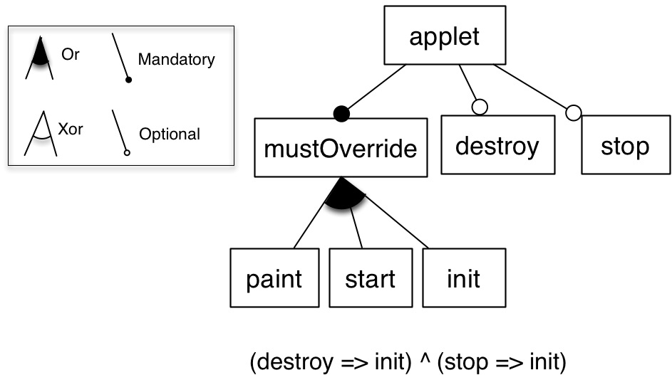

# Feature Model Differences

note: the content was originally written in 2011... we edited some parts

When managing variability of an software product lines, reasoning about the differences of two feature models is of prior importance, as, for instance, SPLs and feature models evolve over time. Even small edits to an feature model, like moving a feature from one branch to another, can unintentionally change the set of valid feature combinations. Understanding the impact of the evolution of a feature model, thus the differences between two versions, is known to be impractical to determine manually.
Until now, the problem of feature model differences has neither been recognized nor comprehensively been tackled by existing approaches. 
We developed a set of syntactic and semantic techniques to compute, reason about and present differences. Thanks to these techniques, a practitioner can understand differences in a fine-grained way, visualize and manage a model of differences, augment an existing feature model with the differences or compute the differences only on some parts of the two feature models.

preprint about Feature Model Differences: https://hal.inria.fr/hal-00713849v2/document


Contributors (in alphabetical order): 
  * [Mathieu Acher (University of Namur, Belgium)](http://www.mathieuacher.com/)
  * [Philippe Collet (University of Nice Sophia Antipolis, France)](http://www.i3s.unice.fr/~collet)
  * Patrick Heymans (University of Namur, Belgium)
  * [Philippe Lahire (University of Nice Sophia Antipolis, France)](http://www.i3s.unice.fr/~lahire)
  * Philippe Merle (INRIA Lille-Nord Europe, France)
  * [Clément Quinton (INRIA Lille-Nord Europe, France)](http://chercheurs.lille.inria.fr/~cquinton/)


# Short Tutorial 

## Running Example 

 


In the following we compute differences between fm1 and fm2 (in this specific order).

## Importing Feature Models 

FAMILIAR provides facilities to import/export feature models, including an internal notation (but other formats like FeatureIDE, SPLOT or TVL can be used as well).

```
fm1 = FM (applet : mustOverride [destroy] [stop] ; mustOverride: (paint|start|init)+ ; destroy -> init ; stop -> init ;  )
fm2 = FM (applet : [mustOverride] [init] ; init : [destroy] [stop] ; mustOverride: (paint|start)+ ; !mustOverride -> init ;  )
```


A first basic differencing technique is to compute the difference between the set of features.
The macthing assumption (shared by existing works in the feature modeling community) is that two features match if and only if they have the same name.
Therefore the difference between two sets of features is based on the features' names.

The following code realizes what we want:

```
s12 = setDiff fm1.* fm2.*
```

fm1.* (resp. fm2.*) returns the set of features of fm1 (resp. fm2).


Note: Instead of setDiff we can use "foreach" loop to iterate over the set and use "eq" or a specific equality relationship between set elements (e.g., features).
In the example, the set is empty
```
fml> setDiff fm1.* fm2.*
res0: (SET) {}
```


## Syntactic Techniques 

We can compute the differences of implies-like relationships including (1) propositional, cross-tree constraints
```
iC1 = getImpliesConstraint fm1
iC2 = getImpliesConstraint fm2
iC12 = setDiff iC1 iC2
```

In the example, it gives:
```
fml> iC1 = getImpliesConstraint fm1
iC1: (SET) {(stop -> init);(destroy -> init)}
fml> iC2 = getImpliesConstraint fm2
iC2: (SET) {}
fml> setDiff iC1 iC2
res0: (SET) {(stop -> init);(destroy -> init)}
```

... or simply (2) parent-child relationships
```
iH1 = getImpliesHierarchy fm1
iH2 = getImpliesHierarchy fm2
iH12 = setDiff iH1 iH2
```


We can also perform the differences on the two kinds of implies
```
i1 = setUnion iC1 iH1
i2 = setUnion iC2 iH2
iSyntacticI12 = setDiff i1 i2
// ...
```

In the example, we obtain:
```
fml> iSyntacticI12
iSyntacticI12: (SET) {(stop -> applet);(init -> mustOverride);(applet -> mustOverride);(destroy -> applet)}
```

Note: we can do the same with excludes or biimplies constraints

If we look at ``` iSyntacticI12 ``` we can observe that this is not semantically correct: for example, (stop -> applet) is actually induced by fm2, i.e., this is ''not'' an accurate difference between fm1 and fm2. 
Semantic techniques are needed (see below).

Accessors are also provided for feature groups 
```
gOR1 = getORGroups fm1
gOR2 = getORGroups fm2
gSyntacticOR12 = setDiff gOR1 gOR2
//...
```

Note: we can do the same with Xor-groups. 

In the example, it gives: 
```
fml> gOR1 = getORGroups fm1
gOR1: (SET) {[init, start, paint] -> mustOverride (OR)}
fml> gOR2 = getORGroups fm2
gOR2: (SET) {[start, paint] -> mustOverride (OR)}
fml> setDiff gOR1 gOR2
res1: (SET) {[init, start, paint] -> mustOverride (OR)}
```

## Semantic Techniques 

Previous techniques can be useful, but are syntactical 
and do not take the semantics of feature models into account. 
The semantics of feature models and main interest of this formalism is to 
characterize a set of configurations. 
FAMILIAR provides semantic techniques for managing and reasoning about differences. 
By taking the semantics into account, these techniques are more powerful since they can produce (1) accurate and (2) more useful differences 


```
/*
calculate the binary implication graph of the feature model
(in FAMILIAR: a set of implies constraint)
*/
i1 = computeImplies fm1
i2 = computeImplies fm2
i12 = setDiff i1 i2
```

In the example:
```
fml> i1 = computeImplies fm1
i1: (SET) {(start -> mustOverride);(applet -> mustOverride);(stop -> mustOverride);(destroy -> mustOverride);(paint -> mustOverride);(init -> mustOverride);(destroy -> applet);(stop -> applet);(stop -> init);(paint -> applet);(start -> applet);(init -> applet);(mustOverride -> applet);(destroy -> init)}
fml> i2 = computeImplies fm2
i2: (SET) {(destroy -> applet);(start -> mustOverride);(stop -> applet);(start -> applet);(mustOverride -> applet);(stop -> init);(init -> applet);(paint -> mustOverride);(paint -> applet);(destroy -> init)}
fml> i12 = setDiff i1 i2
i12: (SET) {(applet -> mustOverride);(stop -> mustOverride);(destroy -> mustOverride);(init -> mustOverride)}
```


Now if we compare iSyntacticI12 and i12, we can see that i12 restitues accurate differences (e.g., (stop -> applet) is no longer a difference) and identifies new differences (e.g., transitive implications).
Note: if you want to only reason about the hierarchy simply make a copy of the feature model, remove all constraints and use same operator

Similarly, we have semantic operators to compute feature groups:
```
gOR1 = computeORGroups fm1
gOR2 = computeORGroups fm2
gOR12 = setDiff gOR1 gOR2
```


Using a semantic technique, we can observe that mustOverride, init and applet are actually forming an OR-group, which is not detected by a syntactic technique
```
fml> gOR2 = computeORGroups fm2
gOR2: (SET) {[init, mustOverride] -> applet (OR);[start, paint] -> mustOverride (OR)}
fml> gSyntacticOR2 = getORGroups fm2
gSyntacticOR2: (SET) {[start, paint] -> mustOverride (OR)}
```

This is indeed correct and induced by the cross-tree constraint ''!mustOverride => init''. 
The OR-group is not restituted as such in the feature diagram (the example is actually extracted from a related work).


### The difference of two feature models is a feature model 

Another technique to reason about differences is to reason in terms of sets of configurations
We can enumerate all valid configurations and compute the difference...

```
s1 = configs fm1
s2 = configs fm2
s12 = setDiff s1 s2
```

But obviously it will not scale (the number of valid configurations is exponential to the number of features). 
To avoid this limitation, we develop a dedicated technique (called merge diff) that consists in first computing the propositional formula and then synthesizing the feature model, if needs be (details are in the CAiSE submission)

```
fm12 = merge diff { fm1 fm2 }
```

fm12 is a model (i.e., a feature model)
It means you can perform all FAMILIAR operations like enumerating, counting, the set of configurations, visualizing the model, merge with others, serialize it

```
s12Bis = configs fm12
assert (s12 eq s12Bis) // obvious
assert (counting fm12 eq size s12) // obvious
...
```


### Decomposing the problem 

For large feature models, it is necessary to decompose the problem into subproblems, typically smaller. 
Here a practitioner can use a decomposition technique, called slice, that focuses on a subset of features (here: applet, mustOverride, start and paint).
He/she can then reuse the differencing techniques presented above:

```
fm1F = slice fm1 including { fm1.applet fm1.mustOverride fm1.start fm1.paint }
fm2F = slice fm2 including { fm2.applet fm2.mustOverride fm2.start fm2.paint }
run "diffReport.fml" { fm1F fm2F }
```

### Composing and serializing 

In the following scenario, we produce a feature model that compactly represents configurations expressed in fm1 but not in fm2 and configurations expressed in fm2 but not in fm1

```
fm21 = merge diff { fm2 fm1 }
fmToDevelop = merge sunion { fm12 fm21 }
```

We have a model that represents the union of differences.
It can be seen as a representation of products no longer supported by existing solutions. 
This model can be used by other stakeholders in the development: 

```
serialize fmToDevelop into featureide // convert the feature model into FeatureIDE format (see output/fmToDevelop.m)
```


 
## Demonstration 

You can have a look at the [http://www.i3s.unice.fr/~acher/familiar/DiffSimpleDemo/ following screencast] that makes use of differencing techniques offered by FAMILIAR in the Eclipse/FeatureIDE environment. 
In this screencast, we use the same example as above.

## A Real World Example 

The following are a visual representation (using [S2T2](http://download.lero.ie/spl/s2t2/) of two feature models of FraSCAti, respectively for version 1.4 (you can also download the feature model ([FML](attachments/DiffFMs/Full14.fml), [FeatureIDE](attachments/DiffFMs/Full14.m) or [S2T2](attachments/DiffFMs/Full14.fmprimitives) format or version 1.5 (you can also download the feature model ([FML](attachments/DiffFMs/Full15.fml), [FeatureIDE](attachments/DiffFMs/Full15.m) or [S2T2](attachments/DiffFMs/Full15.fmprimitives) format.

```
#!html
The case study FraSCAti is a typical example in which the problem of feature model differences occurs and needs to be properly tackled. You can have a look at the presentation made at <a href="http://www.ecsa2011.org/" target="_blank">ECSA'11</a> conference or <a href="http://soft.vub.ac.be/benevol2011/index.html" target="_blank">BENEVOL'11</a> workshop:
<div style="width:425px" id="__ss_10535798"> <strong style="display:block;margin:12px 0 4px"> <a href="http://www.slideshare.net/acher/benevol11-reverse-engineering-architectural-feature-models" title="BENEVOL&#39;11 - Reverse Engineering Architectural Feature Models" target="_blank"> Reverse Engineering Architectural Feature Models</a></strong> <iframe src="http://www.slideshare.net/slideshow/embed_code/10535798" width="425" height="355" frameborder="0" marginwidth="0" marginheight="0" scrolling="no"></iframe></div>
```

The challenge for a practitioner (e.g., software architect) is, for example, to understand and validate the differences between two versions of FraSCAti w.r.t. variability.

 


As a result, we used extensively the techniques presented above as well as the FAMILIAR language/environment. 
